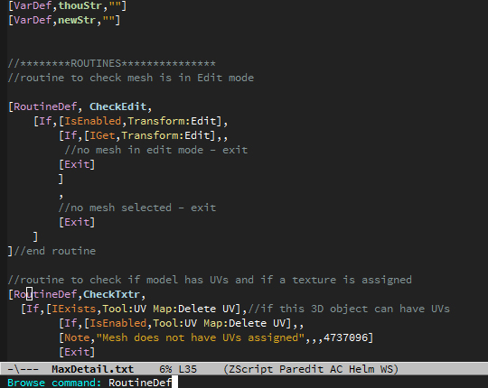

# zscript-mode.el
ZScript for ZBrush editing mode

## Description
zscript-mode is a major mode for editing [ZScript](http://docs.pixologic.com/user-guide/customizing-zbrush/zscripting/) files in Emacs.

## Screenshot
  
MaxDetail.txt from [Max Detail for UV Map](http://docs.pixologic.com/user-guide/customizing-zbrush/zscripting/sample-zscripts/).

## Install
First drop the file zscript-mode.el in a directory defined in your load-path.
Then, put the following two lines to your `.emacs`.

    (require 'zscript-mode)
    (define-key zscript-mode-map (kbd "C-c C-i") 'zscript-browse-command)

## Usage
Open a zscript file and then:

    M-x zscript-mode RET

## Customisation
If you hope to use the downloaded 'Zscript Command Reference' HTML file, just add the following code to your `.emacs`.

    (custom-set-variables
     '(zscript-command-reference-URL
       (browse-url-file-url "path/to/file.html")))
